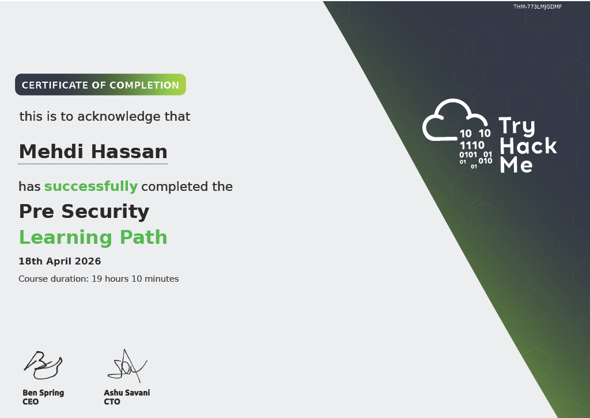

# Mehdi Hassan | Cybersecurity Portfolio

Aspiring **Junior SOC Analyst** | Blue Team Focus  
Self-taught via TryHackMe | Lahore, Pakistan

## About Me
- Building a strong foundation in defensive security (Blue Team)
- Actively learning networking, Linux, web technologies, and log analysis
- Creating detailed write-ups to solidify concepts and track progress
- Background in Python/Django development

## Learning Progress

**Completed Write-ups:**

### Networking Fundamentals
- [HTTP in Detail](writeups/networking-fundamentals/http-in-detail.md)
- [Packets & Frames](writeups/networking-fundamentals/packets-and-frames.md)
- [IP Addressing & Subnetting](writeups/networking-fundamentals/ip-and-subnetting.md)
- [TCP vs UDP](writeups/networking-fundamentals/tcp-vs-udp.md)
- [DNS in Detail](writeups/networking-fundamentals/dns.md)
- [OSI Model](writeups/networking-fundamentals/osi-model.md)
- [LAN](writeups/networking-fundamentals/lan.md)

### Linux
- [Linux Permissions](writeups/linux/linux-permissions.md)
- [Linux Commands Cheatsheet](writeups/linux/linux-commands-cheatsheet.md)
- [Linux Package Management](writeups/linux/linux-package-management.md)

### Fundamentals
- [CIA Triad](writeups/fundamentals/cia-triad.md)
- [Becoming a Defender](writeups/fundamentals/become-defender.md)

### PowerShell
- [PowerShell Basics](writeups/powershell/powershell-basics.md)

## Certifications
- **TryHackMe Pre Security Certificate** (Completed April 2026)

## Goals
- Complete SOC Level 1 path on TryHackMe
- Earn ISC2 Certified in Cybersecurity (CC)
- Develop practical skills in log analysis, SIEM, and incident response
- Secure first Junior SOC Analyst role

## Skills Building
- Networking Fundamentals
- Linux Basics & Permissions
- Web Technologies (HTTP)
- PowerShell Basics
- Python Scripting

---

**Last Updated:** 14 May 2026

Feel free to connect with me:  
**Email:** mehdihassan.exe@proton.me
